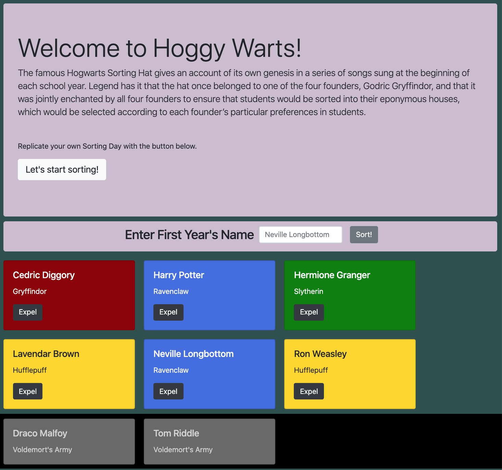

# NSS Exercise: "Sorting Hat”

### Technologies Used:
HTML5, CSS, Vanilla Javascript

### Description:
NSS homework project, used to...
- introduce Bootstrap styling
- practice Javascript concepts of array looping functions and event listener methods
- challenge students to research new concepts for bonus features

Use HTML, CSS styles, and Javascript to design a web page that accepts input to create and display cards for students, which are randomly assigned a House.
 
 
_based on the Sorting Hat concept from the Harry Potter books/films_

#### Exercise Requirements
  - A Bootstrap Jumbotron should appear on page load, with a brief description and instructions
  - A button in the Jumbotron should open a Bootstrap form, which provides an input field for student name and a Submit button
  - Upon Submit, the student's card should display their name and randomly selected House, and clear the input field
  - Each card should also contain an Expel button, which removes them from the record of students
  - App should be responsive to multiple device screen sizes (particularly small screens)

#### Bonus Challenges Completed
  - [x] Error message appears for attempted submission of blank name
  - [x] Color of the student card varies, depending upon House
  - [x] Sort the student cards by some criteria, such as alphabetized names
  - [x] Display the expelled students as a separate set of cards, and style them differently from the others

### Screenshot:
#### Sorted and Expelled students displayed

### Instructions to Run:
1. If you do not have npm http-server installed, follow instuctions [here](https://www.npmjs.com/package/http-server) to install on your device
1. Use GitHub's [Cloning Feature](https://help.github.com/en/github/creating-cloning-and-archiving-repositories/cloning-a-repository) to download a local copy of the files for this project
1. In your command line interface, change directory into the folder that contains your copied files
1. Enter command: `http-server -p 8080` or `hs -p 8080`
1. The project will now render in your browser at url: `http://localhost:8080`